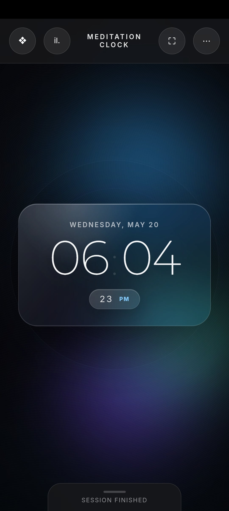

# Meditation Clock (Android)

An Android port of the Meditation Clock web app.
I created this to keep my meditation timer accessible on my phone during an international internet blackout when the main website was completely unreachable.

  

## Features

*   **100% Offline** – No internet connection required after installation. That's the primary reason this app exists! (The main app I mean, for the tracking part you still need access to internet)
*   **Full Theme Support** – Includes all themes and features from the main web repository (up to the date of this build).
*   **Split Screen Use** – It's adapted for both fullscreen usage and split-screen usage. The app doesn't forget the timer if you close the app or switch apps. (It's implemented both in the website's javascript file and the android app kotlin code. )
*   **Distraction-Free** – No ads, no subscriptions, no cluttered interfaces. Just a clock.

## Why this exists

I meditate daily. When I lost international internet access, I wanted to make a semi-neat way to keep my routine without disruption. Trying to run a raw HTML file on a mobile browser wasn't a good experience honestly.

So, I built this Android app. Under the hood, it is essentially a native WebView wrapper around the original web app, but it gets the job done perfectly.

*Note: My main effort goes into the [main web repository](https://github.com/ihummingbird/meditationclock) and the live website. This Android port will likely only receive occasional updates. Consider it a stable, offline-friendly snapshot.*

## Download & Install

You don't need to compile this yourself if you just want to use it.
Grab the latest `app-release.apk` from the **[Releases](../../releases)** page, transfer it to your Android phone, and install it.

*(Note: Your phone might ask for permission to "Install from unknown sources" since it's not from the Google Play Store. It is safe to allow this. And the phone will probably also ask for a Google App Store safety scan, which it will pass).*

##  OR Build it yourself

If you want to poke around the code or rebuild the APK yourself:

1. Clone the repository using your terminal:
   `git clone https://github.com/ihummingbird/meditationclock-android.git`
2. Open the folder in **Android Studio**.
3. Let Gradle sync. 
4. Go to `Build > Build Bundle(s) / APK(s) > Build APK(s)`.

*(Note: It uses an old Gradle release, I had a really really hard time building the apk myself during the international internet blackout in Iran. That's the reason for it. Fixing the dependency issues without any mirrors and only local caches was a nightmare.).*

## License

You are free to use this as you please, but **please don't monetize it or receive money for it, I don't**. This restriction is mostly to protect the custom themes.

All assets in this repository – code, themes, icons, and documentation – are licensed under the **Creative Commons Attribution‑NonCommercial‑ShareAlike 4.0 International License.**

This means you are free to:
*   **Share** – copy and redistribute the material in any medium or format
*   **Adapt** – remix, transform, and build upon the material

Under the following terms:
*   **Attribution** – You must give appropriate credit, provide a link to the license, and indicate if changes were made.
*   **NonCommercial** – You may not use the material for commercial purposes.
*   **ShareAlike** – If you remix, transform, or build upon the material, you must distribute your contributions under the same license as the original.

The themes included in this app are strictly protected by these terms – they cannot be extracted and used commercially. See the full license text for details.

---
Made with ❤️ by Hummingbird
